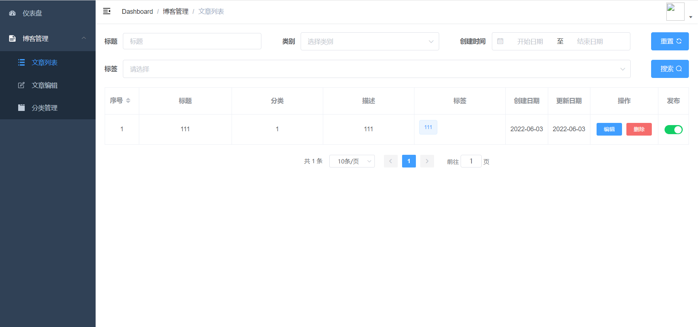
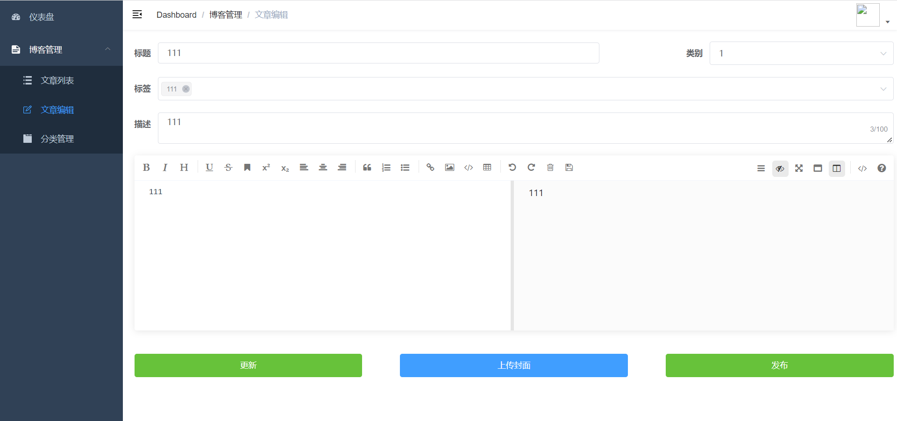
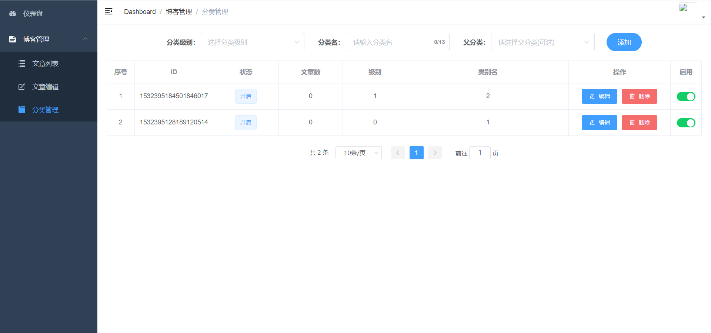
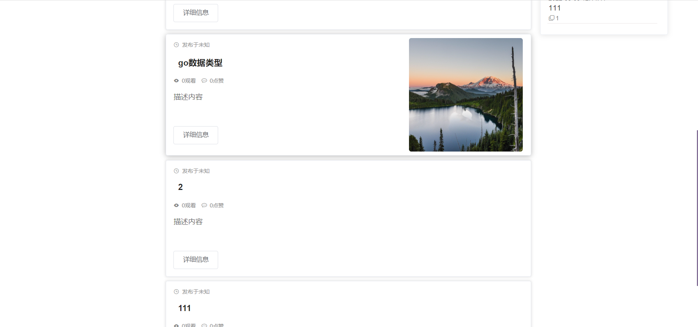
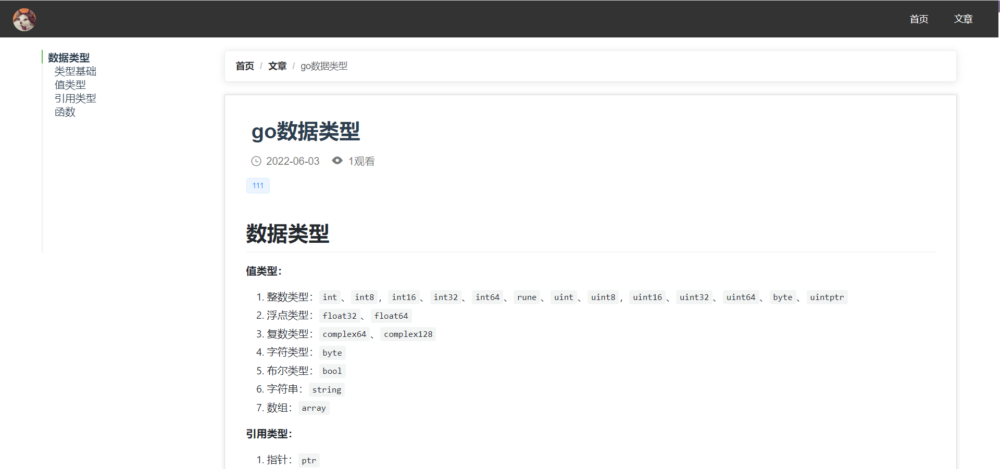

# 博客后台管理
使用vue-element-admin作为后台管理界面，支持markdown格式编辑文章

## 项目启动
```bash
# install dependency
npm install

# develop
npm run dev
```


## 使用技术
前端
- vue
- element-ui
- axios
- normalize.css

后端
- spring boot
- spring security
- mysql
- redis

## 界面
### 管理界面




### 前端界面



